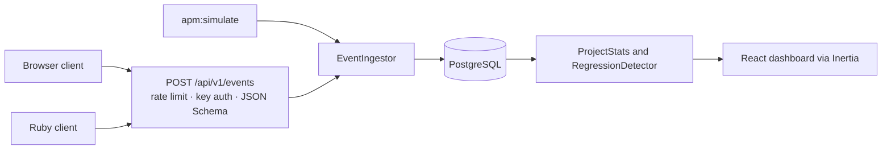

# mini-apm (Rails)

[](https://github.com/gabpese/mini-apm-rails/actions/workflows/ci.yml)
[](LICENSE)


**Read this in:** English · [Português](README.pt-BR.md)

A small, open source application performance monitor. Your apps send usage, error and crash events to a REST API, and a dashboard shows what is happening, including which **version** started crashing more than the one before it.

This is the **Ruby on Rails** build of the project. The same product, with the same API, also exists in Laravel: [mini-apm-laravel](https://github.com/gabpese/mini-apm-laravel). See [Same API, two implementations](#same-api-two-implementations).


> Inspired by real-world experience collecting usage, error and crash data from desktop software. Everything here was written from scratch, around an invented application.

## What it does

- **Receives events** at `POST /api/v1/events`: sessions, feature usage, errors and crashes, in batches, authenticated by a per-project API key.
- **Groups errors** that are the same, by message and the first line of the stack, and counts them.
- **Shows adoption and stability per version**: sessions, users, crash rate and how fast each release spreads.
- **Flags crash regressions.** When the newest version's crash rate reaches a multiple of the previous one's, the dashboard says so. See [how the alert works](#how-the-regression-alert-works).
- **Describes the machines** running your app (operating system, memory, graphics card) and counts who is below your minimum requirements.
- **Fills itself with demo data**: `bin/rails apm:simulate` creates weeks of realistic fictional usage, with a regression on purpose, so the dashboard is never empty.


## Quick start

You need Ruby 3.4, Node 24 and PostgreSQL 17 (see `.ruby-version` and `.node-version`). If you have no PostgreSQL, Docker gives you one:

```bash
docker run --name mini-apm-rails-db -e POSTGRES_PASSWORD=postgres -p 5432:5432 -d postgres:17
export PGHOST=localhost PGUSER=postgres PGPASSWORD=postgres   # config/database.yml reads the libpq defaults
```

On Windows PowerShell, set the three variables with `$env:PGHOST = "localhost"` and so on.

```bash
git clone https://github.com/gabpese/mini-apm-rails.git && cd mini-apm-rails
bin/setup --skip-server      # installs gems and packages, creates and migrates the database
DEMO_USER_EMAIL=demo@example.com DEMO_USER_PASSWORD='change-me-please' bin/rails db:seed
bin/rails apm:simulate       # fills a demo project with fictional data
bin/dev                      # opens http://localhost:3000
```

On Windows, run the scripts through Ruby (`ruby bin/setup --skip-server`, `ruby bin/rails apm:simulate`), and use `.\bin\dev.ps1` instead of `bin/dev`, which needs foreman. It starts the Rails server and Vite together.

Sign in with the account you seeded (the password needs 12 characters or more) and open **Demo App**. You can also create an account on the home page and run `bin/rails apm:simulate` afterwards: it fills the project of the first user.

`apm:simulate` takes its options as environment variables:

| Variable     | Default    | Meaning                                                                   |
| ------------ | ---------- | ------------------------------------------------------------------------- |
| `USER_EMAIL` | first user | Who owns the demo project                                                 |
| `PROJECT`    | `Demo App` | Name of the demo project                                                  |
| `DAYS`       | `30`       | How many days of data to generate                                         |
| `USERS`      | `150`      | How many fictional end users to simulate                                  |
| `SEED`       | `42`       | The same number gives the same data                                       |
| `API_KEY`    | none       | Register this exact key (`apm_` and 20+ letters or digits) for a demo     |
| `FRESH`      | none       | Set to `1` to delete the data of the demo project first                   |

## Sending events

Every project has API keys, created in the project's **Settings**. A key is shown once, because only a hash of it is stored.

```bash
curl -X POST http://localhost:3000/api/v1/events \
  -H "Authorization: Bearer apm_your_key" \
  -H "Content-Type: application/json" \
  -d '{"events":[
        {"type":"session_start","occurred_at":"2026-10-20T14:03:00Z","app_version":"1.2.0","user_ref":"u_8f3a",
         "env":{"os":"Windows 11","ram_mb":16384,"gpu":"GTX 1660"}},
        {"type":"feature_used","name":"export_pdf","occurred_at":"2026-10-20T14:05:12Z","app_version":"1.2.0","user_ref":"u_8f3a"},
        {"type":"crash","message":"Undefined method for nil","stack":"app.rb:10:in `run`","occurred_at":"2026-10-20T14:07:40Z","app_version":"1.2.0","user_ref":"u_8f3a"}
      ]}'
```

| Type            | Needs                                   | Meaning                                                               |
| --------------- | --------------------------------------- | --------------------------------------------------------------------- |
| `session_start` | `env` (optional: `os`, `ram_mb`, `gpu`) | A user opened the app. Counts as a session and describes the machine. |
| `feature_used`  | `name`                                  | A feature was used.                                                   |
| `error`         | `message`, optionally `stack`           | A handled error.                                                      |
| `crash`         | `message`, optionally `stack`           | The app crashed. Feeds the crash rate.                                |

All events need `occurred_at` (ISO 8601) and `app_version`, and may carry a `user_ref`, an anonymous user id. Events are linked to the latest session of the same `user_ref` and version. The exact format of a batch is [`events.schema.json`](events.schema.json), a JSON Schema that the API validates every request against.

|                |                                                                                                       |
| -------------- | ----------------------------------------------------------------------------------------------------- |
| **Auth**       | `Authorization: Bearer <key>` or `X-API-Key: <key>`                                                   |
| **Batch size** | 1 to 100 events. If one is invalid, nothing from the batch is stored (`422`).                         |
| **Rate limit** | 120 requests a minute per key and 600 per IP address (`429`). Invalid keys count too.                 |
| **Answers**    | `202 {"accepted": n}`, `401` bad or revoked key, `422` invalid data, `429` too many requests          |
| **Errors**     | `422` carries `{"message": ..., "errors": {"events.0.type": ["..."]}}`, one entry per invalid field   |
| **CORS**       | Open, so a browser app can send events directly                                                       |

### Clients

The browser client (`clients/js`) and the Ruby client (`clients/ruby`) live in the [Laravel repository](https://github.com/gabpese/mini-apm-laravel/tree/main/clients), because that project came first. They have no dependencies, and they work with this server unchanged: only the address changes.

```js
import { MiniApm } from './mini-apm.js';

const apm = new MiniApm({
    endpoint: 'http://localhost:3000', // this server
    apiKey: 'apm_...',
    appVersion: '1.2.0',
});
apm.start();
```

```bash
ruby clients/ruby/demo_app.rb --key apm_... --url http://localhost:3000
```

Both were run against this server while building it: the Ruby demo app and the JavaScript client sent their events and all were accepted. The `/demo` page of the Laravel app, whose buttons send events from the browser, is not part of this one.

## How the regression alert works

Crash rate is `crashes ÷ sessions` of a version. A version is flagged when:

- its rate is at least **2×** the previous version's, and
- **both** versions have at least **50 sessions**, so a few sessions cannot raise a false alarm.

Both numbers can be changed per project in **Settings**. If the previous version had no crashes at all the ratio is infinite, so the newest version is flagged only when it has at least 3 crashes. Versions are ordered as versions (`1.9.0` before `1.10.0`), not as text. The rule lives in [`RegressionDetector`](app/services/regression_detector.rb).

The alert banner is about the **newest** version, since it is what users run today. Older flagged versions stay marked in the versions table as history.

## How it is built



One Rails application serves both the API and the dashboard, so there is no separate front-end project.

| Layer     | Choice                                                                          |
| --------- | ------------------------------------------------------------------------------- |
| Back end  | Ruby on Rails 8.1, Ruby 3.4                                                     |
| Front end | React 19, TypeScript, Inertia 3 (`inertia_rails`)                               |
| Interface | Tailwind 4, shadcn/ui, Recharts                                                 |
| Database  | PostgreSQL 17                                                                   |
| Tests     | RSpec and FactoryBot: model, service, request and system specs (headless Chrome) |
| Quality   | RuboCop (Rails omakase), Brakeman, bundler-audit, ESLint, Prettier, `tsc`       |
| CI        | GitHub Actions: lint, types, security scans and the whole test suite            |

### Data model

| Table          | Holds                                                                       |
| -------------- | --------------------------------------------------------------------------- |
| `projects`     | One per monitored app: owner, minimum RAM and OS, alert thresholds          |
| `api_keys`     | A SHA-256 hash of each key, never the key. Keys are revoked, not deleted.   |
| `app_sessions` | One per use of the app: version, OS, memory, graphics card                  |
| `events`       | Feature use, errors and crashes, linked to a session and an error group     |
| `error_groups` | Equal errors counted together by their fingerprint                          |

The sessions table is `app_sessions` (and the model `AppSession`) because `Session` is already the login session. The event type is the column `event_type`, since `type` is reserved by Rails for inheritance.

### Decisions worth knowing

- **Keys are hashed.** The text of an API key exists once, when you create it. Like a password, it cannot be shown again.
- **Other people's projects answer 404, not 403**, so nobody can tell which project ids exist. Every lookup goes through `Current.user.projects`.
- **A bad event rejects the whole batch.** Partial writes would make retries create duplicates.
- **The rate limit runs before the authentication**, so a flood of invalid keys is limited too (`rate_limit` in the base API controller).
- **Error groups are opened with `INSERT … ON CONFLICT DO NOTHING`**, so two batches reporting the same new error at once end up sharing one group, and counts are updated in a single `UPDATE`.
- **The simulator uses the same ingestion code as the API**, so demo data is proof that the real path works.
- **The dashboard computes everything with aggregate queries**, so a page costs the same with ten events or ten million.

## Same API, two implementations

[mini-apm-laravel](https://github.com/gabpese/mini-apm-laravel) and this repository are the same product built twice, to compare how each framework solves the same problem. They accept the same batches and answer the same status codes. Where behaviour was in question, the Laravel tests were the reference.

The batch format is written down once, in [`events.schema.json`](events.schema.json). The same file lives in both repositories, and [`events_contract_spec.rb`](spec/requests/api/v1/events_contract_spec.rb) runs a list of 21 valid and invalid batches against the schema and against this API: both must give the same verdict. The Laravel repository runs the same cases.

| Piece                  | Laravel                        | Rails                                            |
| ---------------------- | ------------------------------ | ------------------------------------------------ |
| Database access        | Eloquent                       | Active Record                                    |
| Migrations             | `php artisan make:migration`   | `bin/rails generate migration`                   |
| Validating a batch     | Form Request                   | `events.schema.json` checked with `json_schemer` |
| Validating a project   | Form Request                   | Model validations and strong parameters          |
| API key authentication | Middleware                     | `before_action` in the controller                |
| Rate limiting          | `RateLimiter`                  | `rate_limit` in the controller                   |
| Login                  | Fortify                        | Authentication Zero (from the starter kit)       |
| Demo data              | `php artisan apm:simulate`     | `bin/rails apm:simulate` (Rake task)             |
| Crash regression rule  | Service class                  | Plain Ruby class in `app/services`               |
| Authorization          | Policy                         | Scoping through `Current.user.projects`          |
| Tests                  | Pest                           | RSpec and FactoryBot                             |
| Code style             | Pint                           | RuboCop                                          |
| Database               | SQLite                         | PostgreSQL                                       |

Small differences you may notice:

- This API requires `occurred_at` in ISO 8601 (`2026-10-20T14:03:00Z`), as the JSON Schema says. Laravel accepts any date its parser understands.
- The text of a validation message differs, because the validators differ. The shape of the answer is the same.
- The demo data has the same shape and the same regression, but is not number for number the same, since the two languages draw random numbers differently.

## Development

```bash
bundle exec rspec        # all specs, including the system specs (needs Chrome)
bin/rubocop              # Ruby style
bin/brakeman             # security scan of the code
bin/bundler-audit        # known vulnerabilities in gems
npm run lint             # ESLint
npm run format           # Prettier (npm run format:fix writes the changes)
npm run check            # TypeScript
```

The TypeScript route helpers in `app/javascript/routes` are generated from `config/routes.rb`. After changing a route, run `bin/rails typelizer:generate:refresh`; the CI fails when they are out of date.

On Windows, `npm run lint` and `npm run format` fail because of how the shell handles the quoted patterns. Run `npx eslint "*.{js,mjs,cjs,ts}" app/javascript/ --max-warnings 0` and `npx prettier --check app/javascript "*.{js,mjs,cjs,ts}"` instead.

The [CI workflow](.github/workflows/ci.yml) runs the same checks on every push.

## Deploy

This build has no hosted demo, but the same product runs live in its Laravel twin: [mini-apm.onrender.com](https://mini-apm.onrender.com) (`demo@mini-apm.example` / `demo-mini-apm-2026`). This repository is a showcase to read and run locally. Rails generated a production [`Dockerfile`](Dockerfile) and a [Kamal](https://kamal-deploy.org) setup, which have not been tried here.

## Roadmap

Left out of v1 on purpose:

- email and Slack alerts for regressions
- answering at once and processing each batch in the background with Solid Queue
- teams with several users and permissions
- automatic cleanup of old events
- a public status page that reads the API

## License

[MIT](LICENSE)
