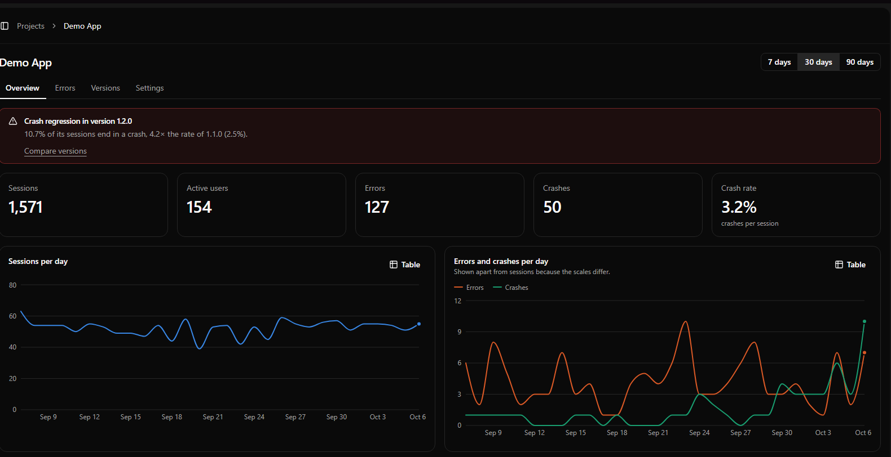
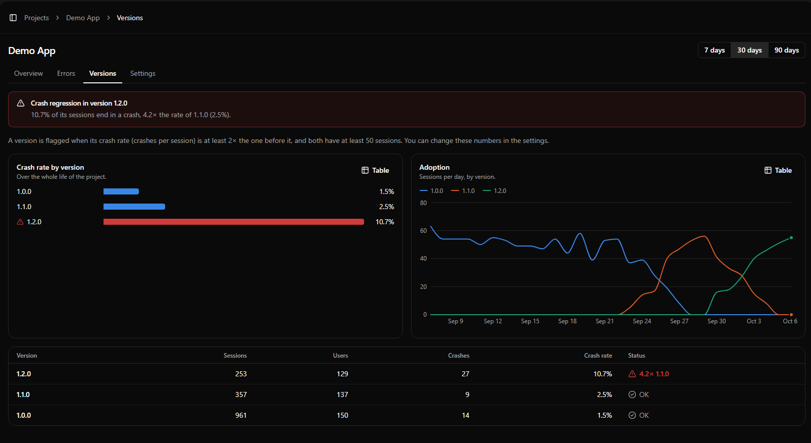
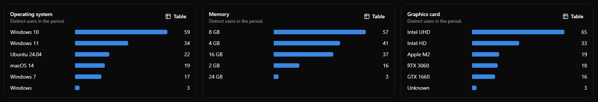
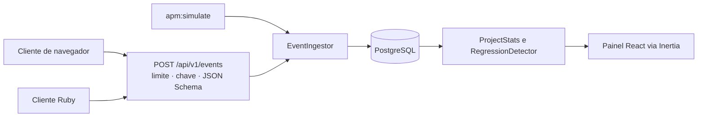

# mini-apm (Rails)

[](https://github.com/gabpese/mini-apm-rails/actions/workflows/ci.yml)
[](LICENSE)


**Leia em:** [English](README.md) · Português

Um monitor de desempenho de aplicações pequeno e de código aberto. Seus apps enviam eventos de uso, erros e crashes para uma API REST, e um painel mostra o que está acontecendo, inclusive qual **versão** começou a travar mais do que a anterior.

Esta é a versão em **Ruby on Rails** do projeto. O mesmo produto, com a mesma API, também existe em Laravel: [mini-apm-laravel](https://github.com/gabpese/mini-apm-laravel). Veja [Mesma API, duas implementações](#mesma-api-duas-implementações).



> Inspirado na experiência real de coletar dados de uso, erros e crashes de um software de desktop. Tudo aqui foi escrito do zero, em torno de uma aplicação inventada.

## O que faz

- **Recebe eventos** em `POST /api/v1/events`: sessões, uso de funcionalidades, erros e crashes, em lotes, autenticados por uma chave de API de cada projeto.
- **Agrupa erros** iguais, pela mensagem e pela primeira linha da pilha, e os conta.
- **Mostra adoção e estabilidade por versão**: sessões, usuários, taxa de crash e a velocidade com que cada versão se espalha.
- **Alerta regressões de crash.** Quando a taxa de crash da versão mais nova chega a um múltiplo da anterior, o painel avisa. Veja [como o alerta funciona](#como-o-alerta-de-regressão-funciona).
- **Descreve as máquinas** que rodam seu app (sistema operacional, memória, placa de vídeo) e conta quem está abaixo dos seus requisitos mínimos.
- **Se enche sozinho com dados de demonstração**: `bin/rails apm:simulate` cria semanas de uso fictício realista, com uma regressão de propósito, então o painel nunca fica vazio.





## Início rápido

Você precisa de Ruby 3.4, Node 24 e PostgreSQL 17 (veja `.ruby-version` e `.node-version`). Se não tiver PostgreSQL, o Docker resolve:

```bash
docker run --name mini-apm-rails-db -e POSTGRES_PASSWORD=postgres -p 5432:5432 -d postgres:17
export PGHOST=localhost PGUSER=postgres PGPASSWORD=postgres   # o config/database.yml usa os padrões do libpq
```

No PowerShell do Windows, defina as três variáveis com `$env:PGHOST = "localhost"` e assim por diante.

```bash
git clone https://github.com/gabpese/mini-apm-rails.git && cd mini-apm-rails
bin/setup --skip-server      # instala gems e pacotes, cria e migra o banco
DEMO_USER_EMAIL=demo@example.com DEMO_USER_PASSWORD='troque-esta-senha' bin/rails db:seed
bin/rails apm:simulate       # enche um projeto de demonstração com dados fictícios
bin/dev                      # abre http://localhost:3000
```

No Windows, rode os scripts pelo Ruby (`ruby bin/setup --skip-server`, `ruby bin/rails apm:simulate`) e use `.\bin\dev.ps1` no lugar do `bin/dev`, que precisa do foreman. Ele sobe o servidor Rails e o Vite juntos.

Entre com a conta criada no seed (a senha precisa ter 12 caracteres ou mais) e abra **Demo App**. Você também pode criar uma conta na página inicial e rodar `bin/rails apm:simulate` depois: ele enche o projeto do primeiro usuário.

O `apm:simulate` recebe as opções por variáveis de ambiente:

| Variável     | Padrão          | Significado                                                                |
| ------------ | --------------- | -------------------------------------------------------------------------- |
| `USER_EMAIL` | primeiro usuário | Quem é dono do projeto de demonstração                                    |
| `PROJECT`    | `Demo App`      | Nome do projeto de demonstração                                            |
| `DAYS`       | `30`            | Quantos dias de dados gerar                                                |
| `USERS`      | `150`           | Quantos usuários finais fictícios simular                                  |
| `SEED`       | `42`            | O mesmo número gera os mesmos dados                                        |
| `API_KEY`    | nenhuma         | Registra esta chave exata (`apm_` e 20+ letras ou números) para uma demo   |
| `FRESH`      | nenhuma         | Use `1` para apagar antes os dados do projeto de demonstração              |

## Enviando eventos

Todo projeto tem chaves de API, criadas em **Settings** do projeto. A chave aparece uma vez, porque só um hash dela é guardado.

```bash
curl -X POST http://localhost:3000/api/v1/events \
  -H "Authorization: Bearer apm_sua_chave" \
  -H "Content-Type: application/json" \
  -d '{"events":[
        {"type":"session_start","occurred_at":"2026-10-20T14:03:00Z","app_version":"1.2.0","user_ref":"u_8f3a",
         "env":{"os":"Windows 11","ram_mb":16384,"gpu":"GTX 1660"}},
        {"type":"feature_used","name":"export_pdf","occurred_at":"2026-10-20T14:05:12Z","app_version":"1.2.0","user_ref":"u_8f3a"},
        {"type":"crash","message":"Undefined method for nil","stack":"app.rb:10:in `run`","occurred_at":"2026-10-20T14:07:40Z","app_version":"1.2.0","user_ref":"u_8f3a"}
      ]}'
```

| Tipo            | Precisa de                              | Significado                                                           |
| --------------- | --------------------------------------- | --------------------------------------------------------------------- |
| `session_start` | `env` (opcional: `os`, `ram_mb`, `gpu`) | Um usuário abriu o app. Conta como sessão e descreve a máquina.       |
| `feature_used`  | `name`                                  | Uma funcionalidade foi usada.                                         |
| `error`         | `message`, opcionalmente `stack`        | Um erro tratado.                                                      |
| `crash`         | `message`, opcionalmente `stack`        | O app travou. Alimenta a taxa de crash.                               |

Todos os eventos precisam de `occurred_at` (ISO 8601) e `app_version`, e podem trazer um `user_ref`, um id anônimo de usuário. Os eventos são ligados à última sessão do mesmo `user_ref` e da mesma versão. O formato exato de um lote é o [`events.schema.json`](events.schema.json), um JSON Schema contra o qual a API valida cada requisição.

|                    |                                                                                                       |
| ------------------ | ----------------------------------------------------------------------------------------------------- |
| **Autenticação**   | `Authorization: Bearer <chave>` ou `X-API-Key: <chave>`                                               |
| **Tamanho do lote** | De 1 a 100 eventos. Se um for inválido, nada do lote é gravado (`422`).                              |
| **Limite**         | 120 requisições por minuto por chave e 600 por endereço IP (`429`). Chaves inválidas também contam.  |
| **Respostas**      | `202 {"accepted": n}`, `401` chave errada ou revogada, `422` dados inválidos, `429` requisições demais |
| **Erros**          | O `422` traz `{"message": ..., "errors": {"events.0.type": ["..."]}}`, uma entrada por campo inválido |
| **CORS**           | Aberto, para que um app de navegador envie eventos direto                                             |

### Clientes

O cliente de navegador (`clients/js`) e o cliente Ruby (`clients/ruby`) ficam no [repositório Laravel](https://github.com/gabpese/mini-apm-laravel/tree/main/clients), porque aquele projeto veio primeiro. Eles não têm dependências e funcionam com este servidor sem mudanças: só o endereço muda.

```js
import { MiniApm } from './mini-apm.js';

const apm = new MiniApm({
    endpoint: 'http://localhost:3000', // este servidor
    apiKey: 'apm_...',
    appVersion: '1.2.0',
});
apm.start();
```

```bash
ruby clients/ruby/demo_app.rb --key apm_... --url http://localhost:3000
```

Os dois foram executados contra este servidor durante a construção: o app de demonstração em Ruby e o cliente JavaScript enviaram seus eventos e todos foram aceitos. A página `/demo` do app Laravel, cujos botões enviam eventos pelo navegador, não faz parte deste.

## Como o alerta de regressão funciona

A taxa de crash é `crashes ÷ sessões` de uma versão. Uma versão é sinalizada quando:

- sua taxa é pelo menos **2×** a da versão anterior, e
- **as duas** versões têm pelo menos **50 sessões**, para que poucas sessões não gerem um falso alarme.

Os dois números podem ser mudados por projeto em **Settings**. Se a versão anterior não teve nenhum crash, a razão é infinita, então a versão mais nova só é sinalizada se tiver pelo menos 3 crashes. As versões são ordenadas como versões (`1.9.0` antes de `1.10.0`), não como texto. A regra está em [`RegressionDetector`](app/services/regression_detector.rb).

O banner do alerta fala da versão **mais nova**, porque é o que os usuários rodam hoje. Versões antigas sinalizadas continuam marcadas na tabela de versões, como histórico.

## Como é construído



Uma aplicação Rails serve a API e o painel, então não há um projeto de front-end separado.

| Camada       | Escolha                                                                          |
| ------------ | -------------------------------------------------------------------------------- |
| Back-end     | Ruby on Rails 8.1, Ruby 3.4                                                      |
| Front-end    | React 19, TypeScript, Inertia 3 (`inertia_rails`)                                |
| Interface    | Tailwind 4, shadcn/ui, Recharts                                                  |
| Banco        | PostgreSQL 17                                                                    |
| Testes       | RSpec e FactoryBot: specs de model, serviço, requisição e sistema (Chrome headless) |
| Qualidade    | RuboCop (Rails omakase), Brakeman, bundler-audit, ESLint, Prettier, `tsc`        |
| CI           | GitHub Actions: lint, tipos, varreduras de segurança e toda a suíte de testes    |

### Modelo de dados

| Tabela         | Guarda                                                                         |
| -------------- | ------------------------------------------------------------------------------ |
| `projects`     | Um por app monitorado: dono, RAM e SO mínimos, limites do alerta               |
| `api_keys`     | O hash SHA-256 de cada chave, nunca a chave. Chaves são revogadas, não apagadas. |
| `app_sessions` | Uma por uso do app: versão, SO, memória, placa de vídeo                        |
| `events`       | Uso de funcionalidades, erros e crashes, ligados a uma sessão e a um grupo de erro |
| `error_groups` | Erros iguais contados juntos pela sua impressão digital                        |

A tabela de sessões se chama `app_sessions` (e o model `AppSession`) porque `Session` já é a sessão de login. O tipo do evento é a coluna `event_type`, já que `type` é reservado pelo Rails para herança.

### Decisões que vale conhecer

- **As chaves são guardadas como hash.** O texto de uma chave de API existe uma vez, quando você a cria. Como uma senha, não pode ser mostrado de novo.
- **Projetos de outras pessoas respondem 404, não 403**, para que ninguém descubra quais ids existem. Toda busca passa por `Current.user.projects`.
- **Um evento ruim rejeita o lote inteiro.** Gravações parciais fariam as novas tentativas criarem duplicatas.
- **O limite de requisições roda antes da autenticação**, então uma enxurrada de chaves inválidas também é limitada (`rate_limit` no controller base da API).
- **Grupos de erro são abertos com `INSERT … ON CONFLICT DO NOTHING`**, então dois lotes que relatam o mesmo erro novo ao mesmo tempo acabam dividindo um grupo, e as contagens são atualizadas num único `UPDATE`.
- **O simulador usa o mesmo código de ingestão da API**, então os dados de demonstração provam que o caminho real funciona.
- **O painel calcula tudo com consultas agregadas**, então uma página custa o mesmo com dez eventos ou dez milhões.

## Mesma API, duas implementações

O [mini-apm-laravel](https://github.com/gabpese/mini-apm-laravel) e este repositório são o mesmo produto construído duas vezes, para comparar como cada framework resolve o mesmo problema. Os dois aceitam os mesmos lotes e respondem os mesmos códigos de status. Onde havia dúvida de comportamento, os testes do Laravel foram a referência.

O formato do lote está escrito uma só vez, no [`events.schema.json`](events.schema.json). O mesmo arquivo existe nos dois repositórios, e o [`events_contract_spec.rb`](spec/requests/api/v1/events_contract_spec.rb) roda uma lista de 21 lotes válidos e inválidos contra o schema e contra esta API: os dois precisam dar o mesmo veredito. O repositório Laravel roda os mesmos casos.

| Peça                       | Laravel                        | Rails                                            |
| -------------------------- | ------------------------------ | ------------------------------------------------ |
| Acesso ao banco            | Eloquent                       | Active Record                                    |
| Migrations                 | `php artisan make:migration`   | `bin/rails generate migration`                   |
| Validação de um lote       | Form Request                   | `events.schema.json` checado com `json_schemer`  |
| Validação de um projeto    | Form Request                   | Validações no model e strong parameters          |
| Autenticação por chave     | Middleware                     | `before_action` no controller                    |
| Limite de requisições      | `RateLimiter`                  | `rate_limit` no controller                       |
| Login                      | Fortify                        | Authentication Zero (do starter kit)             |
| Dados de demonstração      | `php artisan apm:simulate`     | `bin/rails apm:simulate` (tarefa Rake)           |
| Regra de regressão         | Classe de serviço              | Classe Ruby simples em `app/services`            |
| Autorização                | Policy                         | Escopo por `Current.user.projects`               |
| Testes                     | Pest                           | RSpec e FactoryBot                               |
| Padrão de código           | Pint                           | RuboCop                                          |
| Banco                      | SQLite                         | PostgreSQL                                       |

Pequenas diferenças que você pode notar:

- Esta API exige `occurred_at` em ISO 8601 (`2026-10-20T14:03:00Z`), como diz o JSON Schema. O Laravel aceita qualquer data que o seu parser entenda.
- O texto de uma mensagem de validação muda, porque os validadores são diferentes. O formato da resposta é o mesmo.
- Os dados de demonstração têm a mesma forma e a mesma regressão, mas não são número por número iguais, porque as duas linguagens sorteiam números de formas diferentes.

## Desenvolvimento

```bash
bundle exec rspec        # todas as specs, inclusive as de sistema (precisa do Chrome)
bin/rubocop              # estilo Ruby
bin/brakeman             # varredura de segurança do código
bin/bundler-audit        # vulnerabilidades conhecidas nas gems
npm run lint             # ESLint
npm run format           # Prettier (npm run format:fix grava as mudanças)
npm run check            # TypeScript
```

Os helpers de rota em TypeScript, em `app/javascript/routes`, são gerados a partir do `config/routes.rb`. Depois de mudar uma rota, rode `bin/rails typelizer:generate:refresh`; o CI falha quando eles estão desatualizados.

No Windows, `npm run lint` e `npm run format` falham por causa de como o shell trata os padrões entre aspas. Rode `npx eslint "*.{js,mjs,cjs,ts}" app/javascript/ --max-warnings 0` e `npx prettier --check app/javascript "*.{js,mjs,cjs,ts}"` no lugar.

O [workflow de CI](.github/workflows/ci.yml) roda as mesmas verificações a cada push.

## Deploy

Esta versão não tem demonstração hospedada, mas o mesmo produto roda online na versão Laravel: [mini-apm.onrender.com](https://mini-apm.onrender.com) (`demo@mini-apm.example` / `demo-mini-apm-2026`). Este repositório é uma vitrine para ler e rodar localmente. O Rails gerou um [`Dockerfile`](Dockerfile) de produção e uma configuração do [Kamal](https://kamal-deploy.org), que não foram testados aqui.

## Roteiro

Ficou de fora da v1 de propósito:

- alertas de regressão por e-mail e Slack
- responder na hora e processar cada lote em segundo plano com Solid Queue
- times com vários usuários e permissões
- limpeza automática de eventos antigos
- uma página pública de status que lê a API

## Licença

[MIT](LICENSE)
